# Norton - Android Security App

A Norton-inspired Android security application built with Kotlin and Jetpack Compose, featuring a device security scanner and an AI-powered scam detection assistant (Genie). Built as part of the Gen Digital Norton Mobile Engineering AI-First Intern take-home assignment.

> [!NOTE]
> 🎯 **Primary Submission: Option B - Scam Message Detector**
> Out of curiosity, I also built **Option A (Security Health Dashboard)** as a bonus. Both features are fully functional in the app.

---

## Features

### Option B - Genie (Scam Message Detector)
- Paste any suspicious message, URL or email snippet to analyse it instantly
- Powered by Claude Haiku 4.5 via the Anthropic Java SDK with prompt caching (available in sdk)
- Returns risk level (SAFE / SUSPICIOUS / DANGEROUS / UNKNOWN), a confidence score and a plain-english one line explanation
- Offline fallback: regex-based pattern matching when no internet connection is available
- 3 pre-loaded example messages (SMS, EMAIL, URL) for quick testing
- Animated loading state with step-by-step analysis indicators
- Result displayed in a bottom sheet with confidence progress bar

### Option A - Home (Security Health Dashboard) (with mock data)
- Runs four sequential security checks: OS Version, App Threats, Wi-Fi Safety, and Password Strength
- Animated per-check progress: PENDING → SCANNING → COMPLETE
- Spinning circular progress indicator with live percentage counter
- Security score (0–100) with colour-coded circular indicator on results screen
- Results show SECURE / REVIEW status per check

### Shared
- Bottom navigation (Home + Genie)
- Offline banner (slides up above bottom nav when no deice is offline)
- Light and dark theme support

---

## Screenshots

### Genie - Scam Detector

<table>
<tr>
<td align="center"><b>Empty State</b></td>
<td align="center"><b>With Input</b></td>
<td align="center"><b>Result (Safe)</b></td>
<td align="center"><b>Result (Dangerous)</b></td>
<td align="center"><b>Result (Suspicious)</b></td>
</tr>

<tr>
<td align="center">
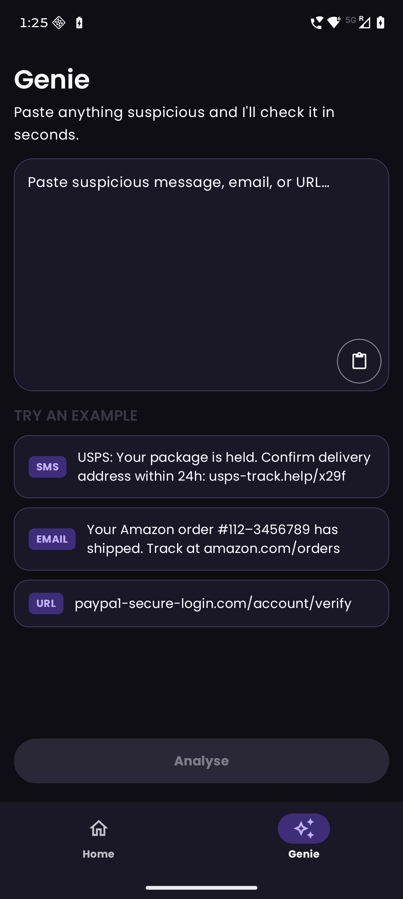
</td>

<td align="center">
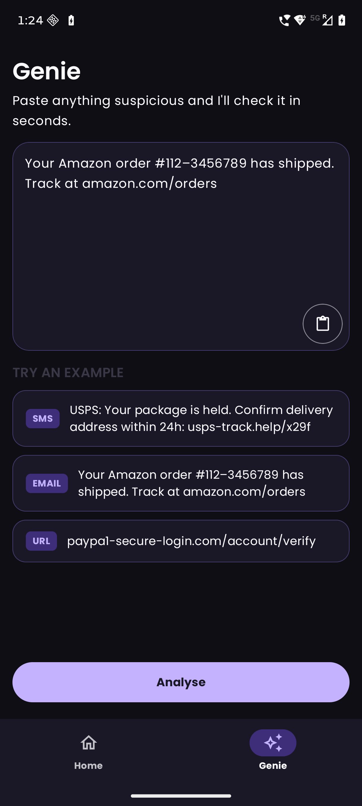
</td>

<td align="center">
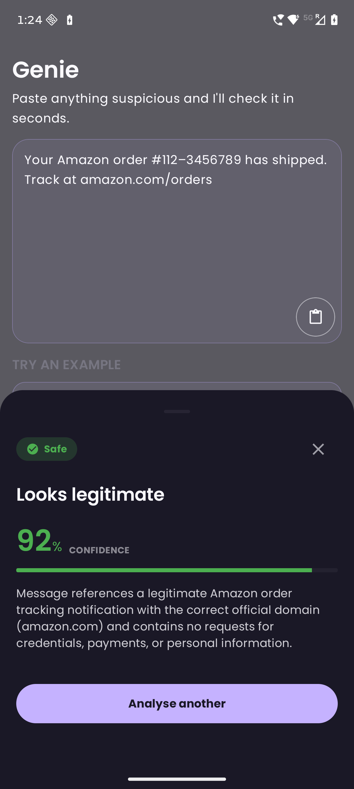
</td>

<td align="center">
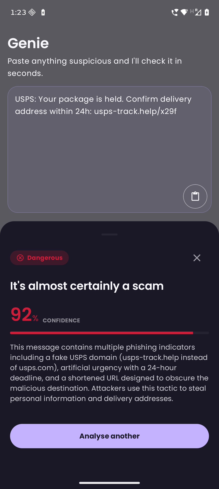
</td>

<td align="center">
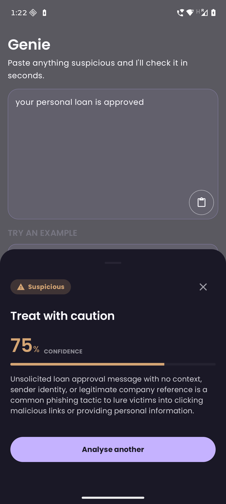
</td>
</tr>

<tr>
<td align="center">
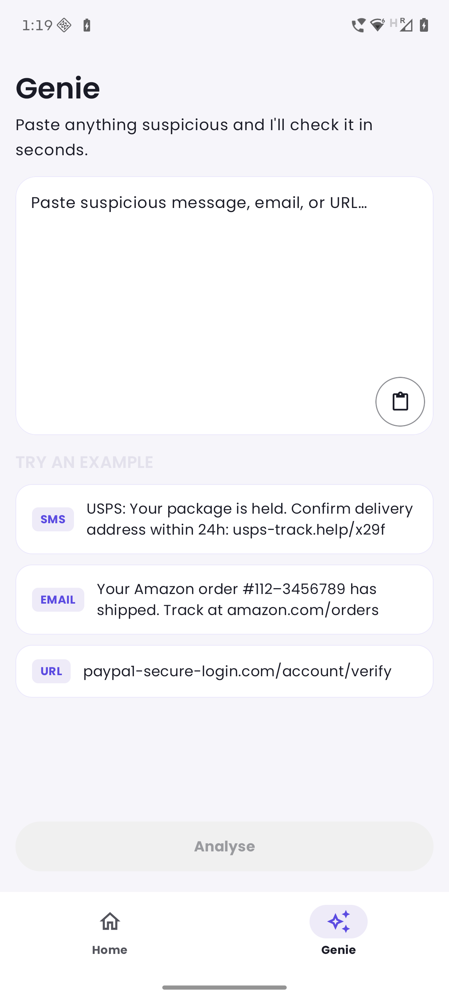
</td>

<td align="center">
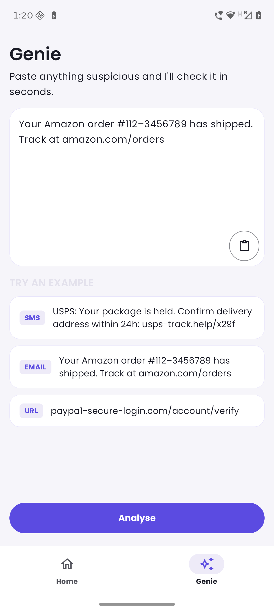
</td>

<td align="center">
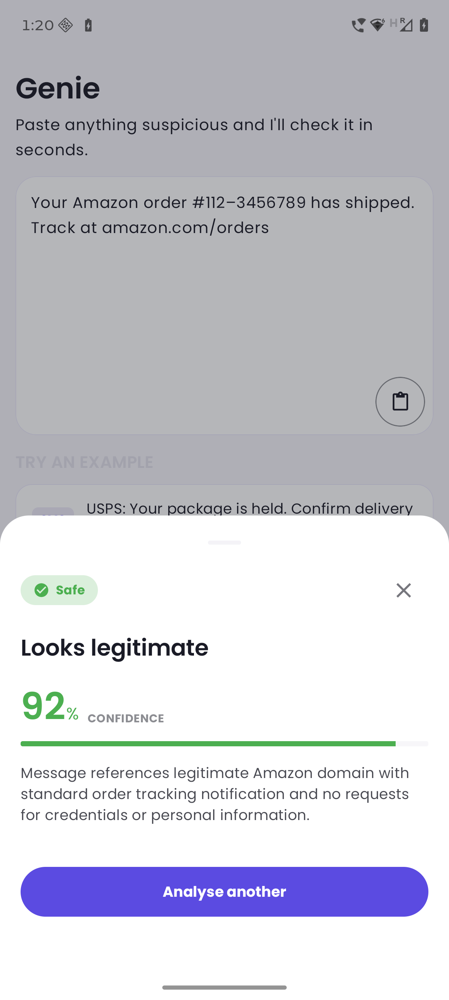
</td>

<td align="center">
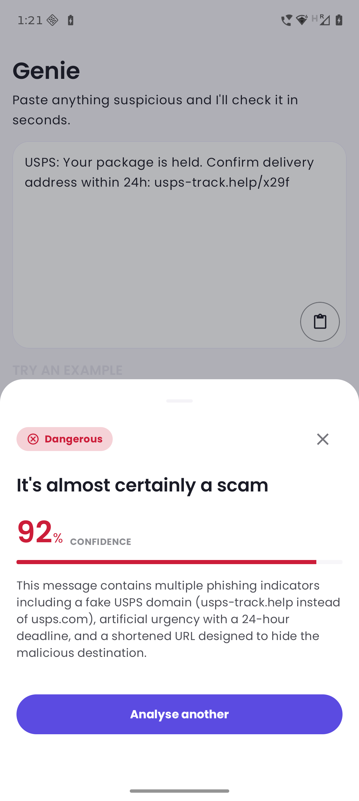
</td>

<td align="center">
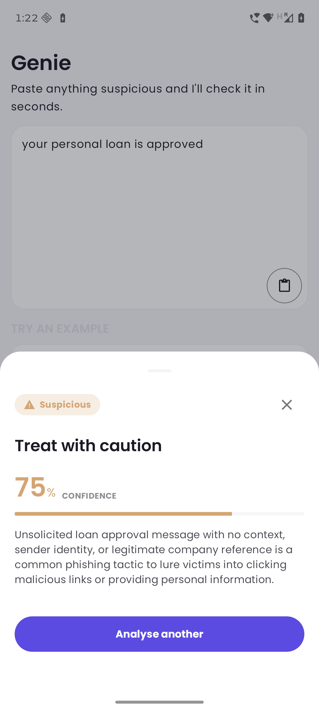
</td>
</tr>
</table>


---

### Home - Security Scanner

<table>
<tr>
<td align="center"><b>Dashboard</b></td>
<td align="center"><b>Scanning</b></td>
<td align="center"><b>Scan Complete</b></td>
<td align="center"><b>Scan Result</b></td>
</tr>

<tr>
<td>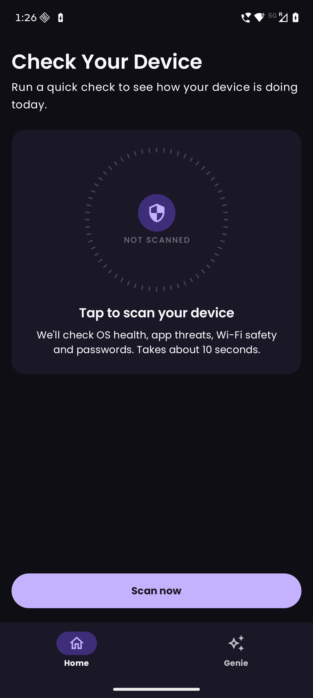</td>
<td>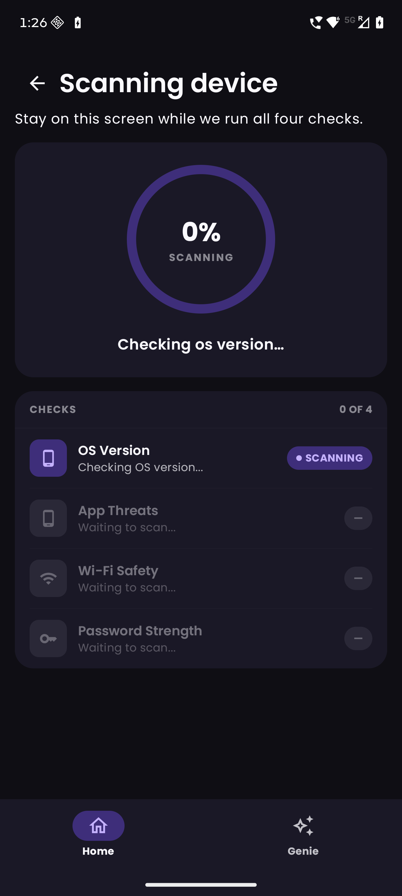</td>
<td>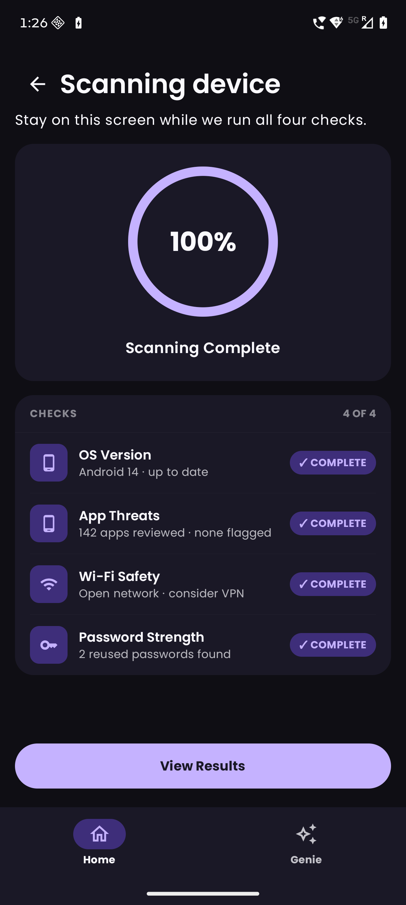</td>
<td>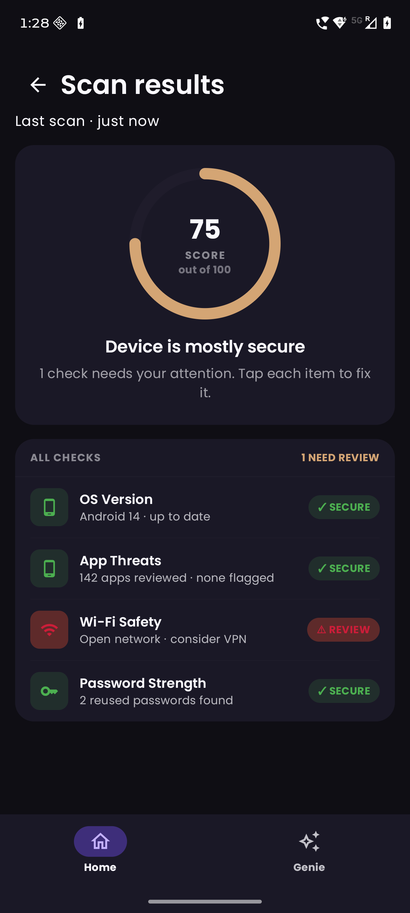</td>
</tr>

<tr>
<td>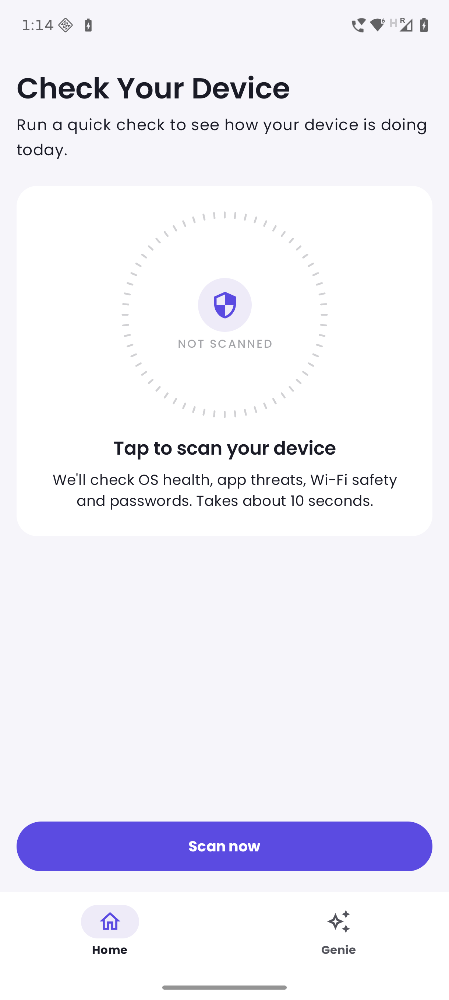</td>
<td>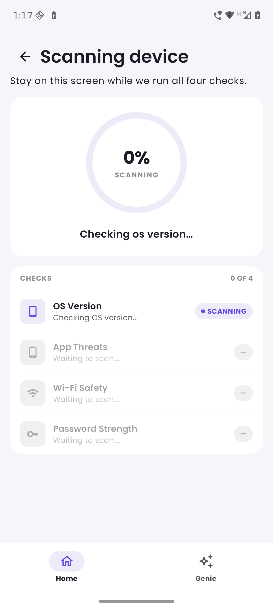</td>
<td>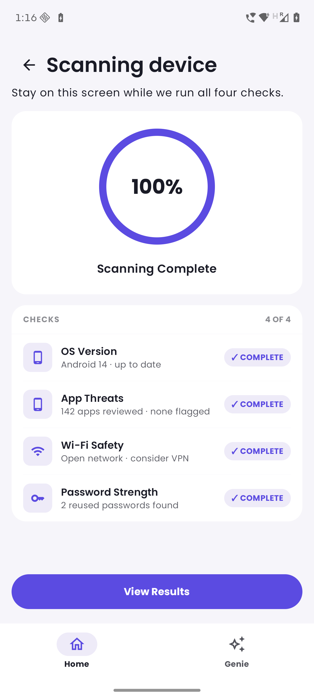</td>
<td>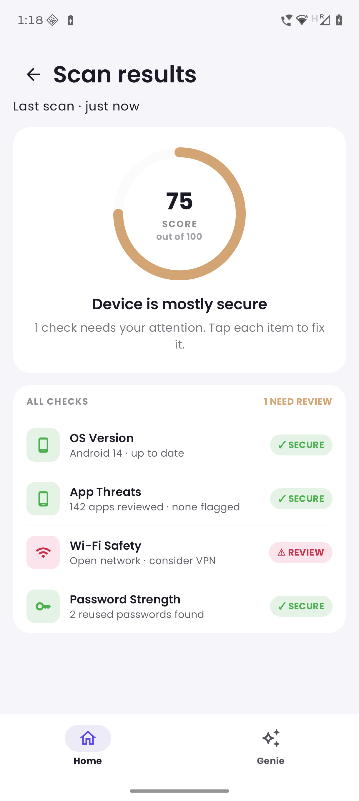</td>
</tr>
</table>

---

## Tech Stack

| Layer | Technology |
|---|---|
| Language | Kotlin |
| UI | Jetpack Compose + Material 3 |
| Architecture | MVI + Clean Architecture |
| DI | Dagger Hilt |
| Navigation | Jetpack Navigation Compose |
| AI / API | Anthropic Java SDK (Claude Haiku 4.5) |
| Async | Coroutines + Flow |
| Testing | JUnit 5, MockK, coroutines-test |

---

## Project Structure

```
app/src/main/java/com/charan/norton/
│
├── common/
│   ├── components/          # Shared UI (PrimaryButton, TitleText, SubTitleText, BottomNavBar, DeviceOffline)
│   ├── navigation/          # NavGraph, Screen routes
│   ├── network/             # NetworkChecker interface + AndroidNetworkChecker
│   └── theme/               # Color, Typography, Theme
│
├── di/
│   └── AppModule.kt         # Hilt module - repositories, NetworkChecker, AnthropicClient
│
├── features/
│   ├── genie/
│   │   ├── data/repository/ # GenieRepositoryImpl (Anthropic API call + prompt)
│   │   ├── domain/
│   │   │   ├── model/       # ScamResult, RiskLevel
│   │   │   ├── repository/  # GenieRepository interface
│   │   │   └── usecase/     # AnalyseMessageUseCase (online + offline regex fallback)
│   │   └── presentation/
│   │       ├── components/  # InputField, GenieResult, GenieAnalysing, ExampleChip, NortonIconButton
│   │       ├── GenieContract.kt
│   │       ├── GenieScreen.kt
│   │       └── GenieViewModel.kt
│   │
│   └── scan/
│       ├── data/
│       │   ├── datasource/  # MockScanDataSource (structured as real API response)
│       │   └── repository/  # ScanRepositoryImpl
│       ├── domain/
│       │   ├── model/       # SecurityScore, ScanCheck, CheckStatus
│       │   ├── repository/  # ScanRepository interface
│       │   └── usecase/     # RunScanUseCase
│       └── presentation/
│           ├── components/  # CheckItemRow, ScanProgressIndicator, NotScannedIndicator, StatusPill
│           ├── ScanContract.kt
│           ├── HomeScreen.kt
│           ├── ScanScreen.kt
│           ├── ScanResultScreen.kt
│           ├── ScanResultViewModel.kt
│           └── ScanViewModel.kt
│
└── MainActivity.kt
└── NortonApplication.kt
```

---

## Setup Instructions

### Prerequisites

- Android Studio Hedgehog or later
- JDK 11+
- Android SDK with API 36 installed
- An [Anthropic API key](https://console.anthropic.com/)

### 1. Clone the repository

```bash
git clone https://github.com/charanprasanth/Norton.git
cd Norton
```

### 2. Add your Anthropic API key

Create or open `local.properties` in the project root and add:

```properties
ANTHROPIC_API_KEY=sk-ant-xxxxxxxxxxxxxxxx
```

> `local.properties` is git-ignored

### 3. Build and run

Open the project in Android Studio, let Gradle sync complete, then:

- **Run on device/emulator:** Click `Run` button or press `Shift + F10`

### 4. Run tests

```bash
./gradlew test
```
---

## Architecture Overview

The app follows **Clean Architecture** with an **MVI** presentation pattern.
```
Presentation
(ViewModel, Screen)
      ↓
   Domain
(UseCase, Repository interface, Models)
      ↑
    Data
(Repository, DataSource)
```

- **Domain** has zero Android dependencies - pure Kotlin interfaces, models and use cases
- **Data** implements domain interfaces; all Android-specific code lives here
- **Presentation** holds ViewModels (Hilt-injected), state, actions and Compose screens

---

## AI Interaction Log

Throughout the project I used Claude (claude.ai and Claude Code) as my primary AI assistant. I used chatgpt twice for refining my prompt. Below are five significant interactions that shaped the implementation.

---

## My AI Journey With This Project

Before writing a single line of code, I started with Claude Design to visualise the screens. I used ChatGPT to optimise my initial rough prompt into something more structured, then fed it to Claude Design to generate the mockups.

**Design Prompt (optimised the prompt with ChatGPT):**

```
I'm building an app like norton 360 security app with two features. design simple, clean UI screens for these:

feature1: GENIE (scam detection)
- one main screen with:
  1. input field (placeholder: "paste suspicious message, email or link")
  2. 3 example scam message buttons below (quick-tap to populate input)
  3.  `Analyze` button (primary CTA)
  4. show loader state
  5. bottom sheet showing results after analyzing with he following info
    - risk level badge (safe - green, suspicious = yellow, dangerous = red
    - confidence score (percentage)
    - one line explanation
    - retry button
design approach - minimalist, card-based with focus on readability
feature2: SCAN (security health dashboard)
- screen1 - dashboard:
  show `not scanned` and add `scan now` button - primary CTA and add a message like `tap to scan your device`
- screen2 - scanning:
  1. show scanning animation with scan progress
  2. list 4 security checks below, like `os version`, `app threats`, `wiffi`, with icon and small description -> scanning one by one
- screen3 - scan results
  1. show final score
  2. show status of all check done
  3. overall summary (example - device is secure)
 
bottom navigation bar with two tabs (HOME-scan, GENIE-scam detection) connect both feature1 and feature2
- use simple material icons and highlight active tab
- create jetpack compose friendly design and poppins font family
- color palette: primary - blue/purple, success - green, warning-yellow, danger-red, neutral - grey
- no heavy animations or complex ui

also provide design mockups for each screen, color palette and typography guide with font sizes and weights
```

Claude Design returned full screen mockups, a complete color palette with hex codes, and a typography scale - which I used directly when writing `Color.kt` and `Type.kt`. This was the foundation everything else was built on.

From there I moved to Claude (claude.ai) for architecture planning, then to Claude Code for implementation. Each tool played a different role:

- **ChatGPT** - prompt refinement
- **Claude Design** - screen design and design system
- **Claude (claude.ai)** - architecture decisions, code review, debugging
- **Claude Code** - implementation, file generation, refactoring

